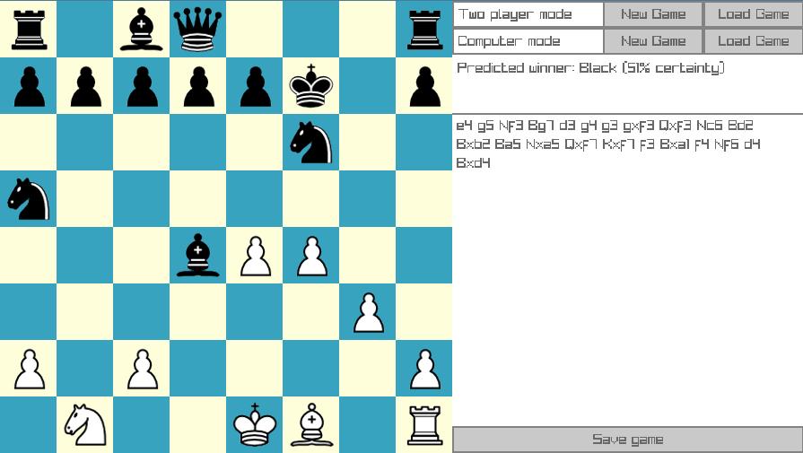

# A chess game & engine

## Features
- 
- Computer move generation
    - minimax (negamax), alpha-beta pruning & iterative deepening; usually 7+ move depth
    - Move ordering based on captures and a stored principal variation
    - Polyglot BIN format opening book support
    - Transposition table optimisations
- Chess GUI implemented using [Raylib](https://github.com/raysan5/raylib) and [Raygui](https://github.com/raysan5/raygui)
- Local player-vs-player and player-vs-computer modes
- Game loading and saving in FEN (Forsyth–Edwards Notation)
- All chess rules are supported except the 50 move rule, repetition and promotion to non-queen pieces
- Supports Linux, Windows, macOS, FreeBSD, probably anything Raylib supports

## Screenshot


## Installation
Binaries are available for [Linux](https://github.com/camc/chess/releases/download/v0/game-build-linux-amd64.zip) and [Windows](https://github.com/camc/chess/releases/download/v0/game-build-windows-amd64.zip).

## Building

Required dependencies to build are CMake, a C11 compiler and the [build dependencies of Raylib](https://github.com/raysan5/raylib/wiki/Working-on-GNU-Linux/4eec3af730128bdb5f85553b37a325a853034ae7).  

Build steps on Linux:
```sh
git clone https://github.com/camc/chess
cd chess
cmake -B build -DCMAKE_BUILD_TYPE=Release
cmake --build build --config Release
# Run: ./build/chess
```